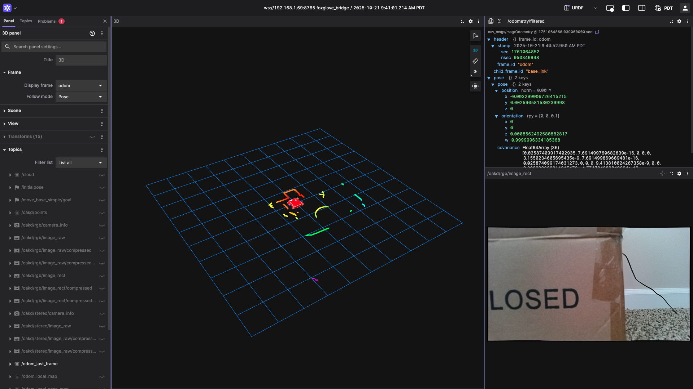

# This repository contains the ROS2 Driver for our Gobilda robot setup in class CPE416 
# ROS2 Driver and Jetson Orin Nano Setup

## Prerequisites (tested on following hardware)

- Jetson Orin Nano Super Dev Kit
- Gobilda Starter Kit
- WiFi connectivity, Ethernet connectivity
- A1 RP LiDAR
- Oak-d Pro Camera
- Ethernet, USB Cables, Power Cables
- 12V Gobilda Battery

## Dependencies

Before you begin, ensure you have met the following requirements:

- ROS2 Humble Installation
- Ubuntu 22.04.5 LTS
- Jetpack 6.0

## Setup Guide Gobilda, ROS2, Jetson Orin Nano

### Connection to the internet
Hey! You cannot clone this repo without being connected to the internet. The best option we have for our Orin platforms is to run the *tigervnc_setup.sh* script (found in this repo) to properly connect the Orin to the *CP-IoT-Secure* network.

Note that your Orin maybe already be configured to do that. Also, note that you *are* able to connect to the Orin even when your laptop is connected to the *eduroam* ssid and the Orin to the *CP-IoT-Secure* ssid.

### Clone the Repository
Once connected to the internet you can clone this repo with the following command:

```bash
git clone --recursive https://github.com/ambulantelab/gobilda.git
```

### Setup the permissions, udev rules, and pwm groups
Before you can use the ros2 driver successfully, there are a number of permission and udev rules that need to be changed.
#### 1. jetson-io.py
We first need to set pins 15 & 32 to send pwm signals on the dev kit's 40-pin expansion board. Fortunately, NVIDIA provides a terminal tool for generating the required files. Run the following command (from any directory):
```bash
sudo /opt/nvidia/jetson-io/jetson-io.py
```
Select the following options: Configure Jetson 40pin Header -> Configure header pins manually -> pwm1 & pwm7 -> Save pin changes -> Save and exit without rebooting
(We will reboot the Orin in a moment)

#### 2. Create 'pwm' group and write udev rules
Then, we need to run the follwing script (in the ~/gobilda/env_scripts/ directory) which will copy the udev rules to the corresponding directory and create a group 'pwm' that will allow our user to send pwm commands without sudo permissions:
```bash
sudo bash jetson_orin.sh
```
After running the above command we can reboot the Orin Nano:
```bash
sudo shutdown now
```

#### 3. Compile and test the 'simple_pwm.cpp'
Finally, to make sure that everything is wired correctly and that we can send pwm signals, let's compile and run the simple_pwm code:
To compile the file and run the executable:
```bash
# Compile code
g++ simple_pwm.cpp -o simple_pwm

# Run the executable
./simple_pwm
```
When you run the executable you should see output and soon the wheels of your Gobilda robot should start moving!
After, confirming that this code works we can move to compiling the ROS2 workspace and running more advanced software techniques.

### Compiling the Driver
#### 1. Update CMake
After you can cloned the repo, we can try building the driver. Because the default cmake version installed does not work for the driver, we'll first need to update our cmake, we can use the provided script (env_scripts/update_cmake.sh) to do that:
```bash
sudo bash update_cmake.sh
```
#### 2. Source Underlay & Install ROS2 dependencies
Before we can compile and run ros2 commands we need to make sure that ros2 is sourced (activated) in our terminal session. Run the following command to source your underlay ROS2 Humble:
```bash
source /opt/ros/humble/setup.bash
```
Now when you run the "ros2" command in your terminal you should see the CLI menu output. 

Next we should install all the dependencies that are required for the driver. Run the following commands at the workspace level (/gobilda_ws/):
```bash
# Update rosdep database
rosdep update

# Install dependencies for a specific package
rosdep install --from-paths src --ignore-src -r -y
```
This command should have installed many packages that are required for the driver to work correctly.

#### 3. Compilation
To compile the worksapce run
```bash
# ROS2 Compilation Command
colcon build --symlink-install
```
Workspace should compile with no, issues. (If you see a Cmake warning output you can safely ignore that.)

#### 4. Source Overlay & ROS2 Launch Files
After the workspace has compiled successfully, we need to make sure that the workspace (overlay) is sourced. This allows ROS2 to see your packages and source code. Run the following command from the root of the workspace:
```bash
# Source the overlay
source install/setup.bash
```

Finally, try the following launch file to run an odom (ekf) setup for the robot:
```bash
# EKF Odom for Gobilda
ros2 launch gobilda_robot gobilda_ekf_odom_viz.launch.py
```

If all the nodes launched successfully, you should see the following output: (NOTE: This screenshot was taken from the Foxglove application. See section on Foxglove for more info.)


## Foxglove (Runs Locally on your Computer)
Check out the official [Foxglove documentation](https://docs.foxglove.dev/docs) (Screenshot Above!) to get started.

Foxglove is a powerful, cross-platform visualization tool that we'll use throughout this course to better understand and interpret data from our sensors and robots. One of the key advantages of Foxglove is that it can be installed locally on your laptop and run independently — no ROS 2 installation is required on your machine. 

Before downloading the desktop application, you’ll need to create a free Foxglove account. Once you're in, pay special attention to the Overview and Frameworks → ROS 2 sections of the documentation, as they’ll give you a solid foundation for integrating Foxglove with the tools we'll be using.

(Finally, note that the *ros-humble-foxglove-bridge* package should have been installed on the Orin when you installed dependencies using the rosdep commands.)

## 📁 Workspace Structure
This project follows a standard ROS 2 workspace layout, organized into a few core packages that each serve a specific purpose in controlling and operating the GoBilda robot.

### Packages
#### *gobilda_robot*
This is the main package for integrating the GoBilda hardware with ROS 2. It is subdivided into the following components:

##### 1. bringup
Contains launch files and configuration files used to start all the necessary ROS 2 nodes that control the GoBilda robot. This includes node parameters, launch arguments, and any required startup logic for the robot’s software stack.

##### 2. description
Holds the robot’s URDF (Unified Robot Description Format) files, which define the structure and kinematics of the robot. This includes the definition of links, joints, physical dimensions, and coordinate transformations, which are critical for tasks like visualization, simulation, and motion planning.

##### 3. hardware
Implements the low-level interface between ROS2 and the Jetson Orin Nano’s GPIO pins. This is the core of the robot’s driver layer, handling direct communication with motors through the (GoBilda) motor controllers. It provides the foundation for higher-level control of the robot through ROS2.

#### *gobilda_utilities*
Some utility nodes for tele-operating the robot and subscribing to sensor data.

#### *kiss_icp*
KISS-ICP stands for K(eep) I(t) S(mall) and S(imple) I(terative) C(losest) P(oint), a lightweight LiDAR odometry solution developed by Vizzo et al. @ the University of Bonn. This ROS 2 node processes LiDAR scan data from the GoBilda robot to estimate its motion and position over time — all without relying on wheel encoders or external localization systems.

It’s an efficient and nice approach to real-time odometry, well-suited for mobile robots operating in structured environments. If you're interested in the algorithmic details, be sure to check out the [original research paper](https://www.ipb.uni-bonn.de/wp-content/papercite-data/pdf/vizzo2023ral.pdf).
